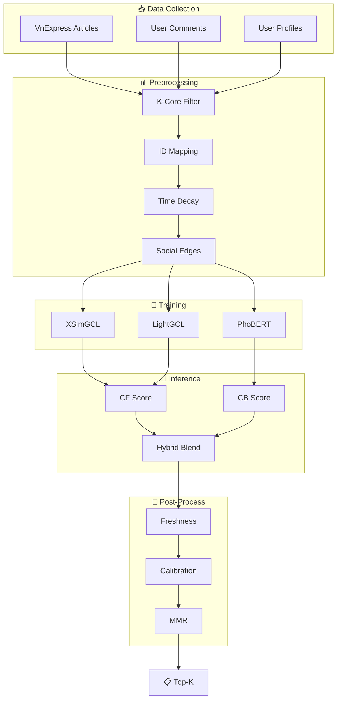

# Hướng dẫn Export Mermaid Diagrams sang PNG

## Phương pháp 1: Mermaid Live Editor (Nhanh nhất)

1. Truy cập: https://mermaid.live/
2. Copy nội dung từ các file `.mmd` trong thư mục `docs/diagrams/`
3. Paste vào editor bên trái
4. Click "Export" → "PNG" hoặc "SVG"

### Files có sẵn:
- `pipeline_main.mmd` - Diagram tổng quan pipeline
- `postprocessing.mmd` - Diagram post-processing

---

## Phương pháp 2: VS Code Extension

1. Cài extension: "Markdown Preview Mermaid Support"
2. Mở file `docs/pipeline_architecture.md`
3. Click Preview (Ctrl+Shift+V)
4. Right-click diagram → "Save Image As"

---

## Phương pháp 3: Command Line (nếu có quyền sudo)

```bash
# Cài mermaid-cli
sudo npm install -g @mermaid-js/mermaid-cli

# Export PNG
mmdc -i docs/diagrams/pipeline_main.mmd -o docs/diagrams/pipeline_main.png -b transparent
mmdc -i docs/diagrams/postprocessing.mmd -o docs/diagrams/postprocessing.png -b transparent
```

---

## Quick Links cho Mermaid Live Editor

### Pipeline Tổng Quan
Copy và paste vào https://mermaid.live/:


