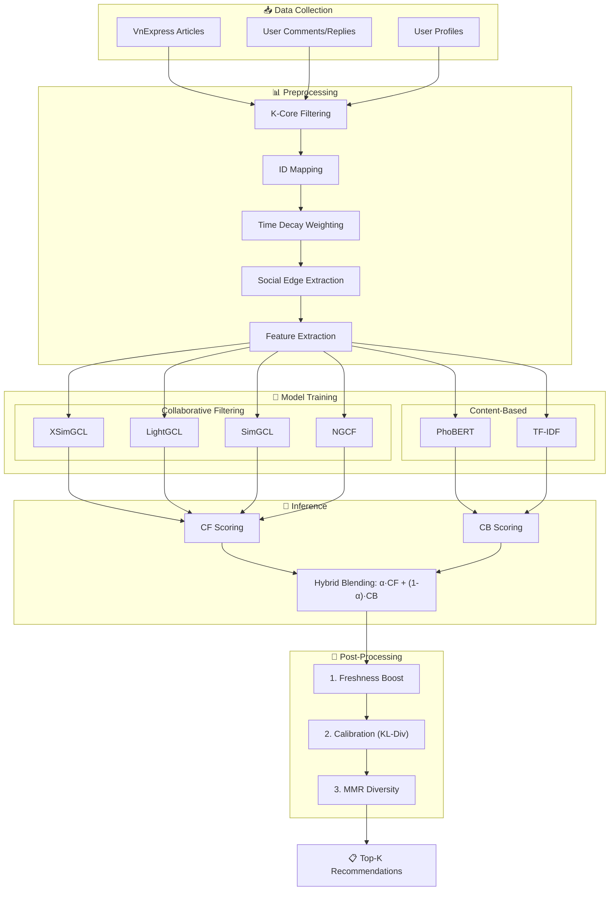
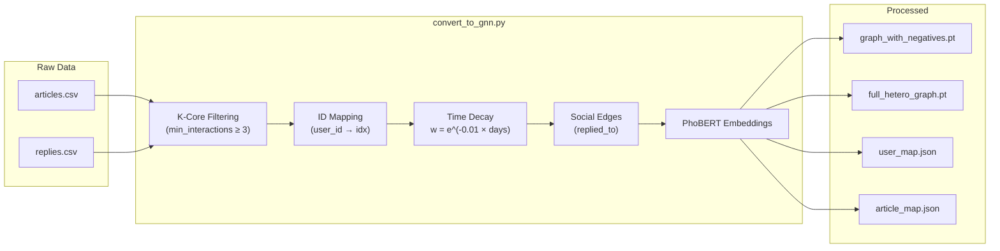
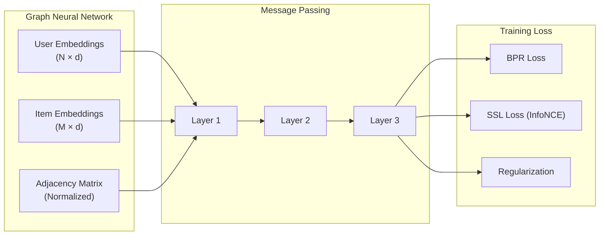
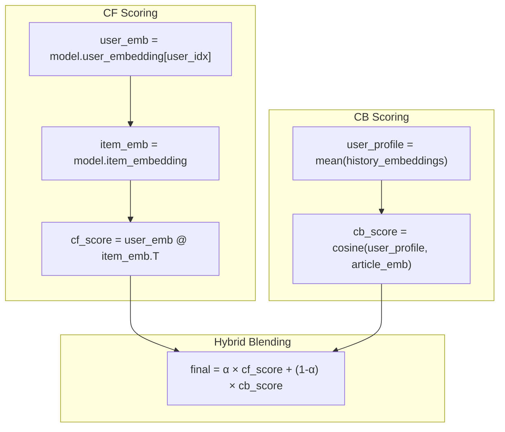
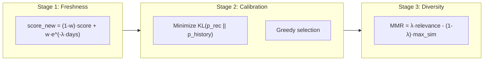

# Smart Hybrid News Recommendation Pipeline

## Kiến trúc tổng quan

---

## Chi tiết từng giai đoạn

### 1. Data Collection
| Module | File | Chức năng |
|:---|:---|:---|
| Article Crawler | `crawlers/main_crawler.py` | Thu thập bài báo (title, content, category) |
| Comment Crawler | `crawlers/comment_crawler.py` | Thu thập comments và replies |
| Profile Crawler | `crawlers/user_profile_crawler.py` | Thu thập thông tin user |

### 2. Preprocessing

| Bước | Công thức/Mô tả |
|:---|:---|
| K-Core Filtering | Loại bỏ user/item có ít hơn N tương tác |
| Time Decay | $w_{edge} = e^{-\lambda \cdot \Delta t}$ với $\lambda = 0.01$ |
| Social Edges | Trích xuất `(replier → parent)` từ replies |

### 3. Model Training

#### Collaborative Filtering Models

| Model | Đặc điểm chính |
|:---|:---|
| **XSimGCL** | Noise-based contrastive learning, không cần augmentation phức tạp |
| LightGCL | SVD-based augmentation, hiệu quả trên sparse data |
| SimGCL | Uniform noise perturbation |
| NGCF | Bipartite graph convolution cơ bản |

#### Content-Based Models
| Model | Input | Output |
|:---|:---|:---|
| PhoBERT | Vietnamese text | 768-dim embeddings |
| TF-IDF | Bag-of-words | Sparse vectors → Cosine similarity |

### 4. Inference (Scoring)

### 5. Post-Processing

| Stage | Mục đích | Tham số |
|:---|:---|:---|
| **Freshness Boost** | Ưu tiên tin mới (quan trọng cho News) | `freshness_lambda=0.1`, `boost_weight=0.2` |
| **Calibration** | Đảm bảo tỷ lệ category khớp sở thích user | `alpha=0.5` |
| **MMR Diversity** | Tránh gợi ý nhiều bài giống nhau | `lambda_mmr=0.5` |

---

## Thống kê dữ liệu

| Metric | Giá trị |
|:---|:---|
| **Số Users** | 4,266 |
| **Số Articles** | 2,299 |
| **Số Interactions** | 64,944 |
| **Sparsity** | 99.34% |
| **Social Edges** | 26,359 |

---

## Công thức chính

### Time Decay Weight
$$w_{edge} = e^{-\lambda \cdot (t_{now} - t_{interaction})}$$

### Hybrid Blending
$$score_{final} = \alpha \cdot score_{CF} + (1-\alpha) \cdot score_{CB}$$

### Freshness Boost
$$score_{boosted} = (1-w) \cdot score_{rel} + w \cdot e^{-\lambda \cdot days\_old}$$

### KL-Divergence Calibration
$$\min \sum_c p_{rec}(c) \cdot \log\frac{p_{rec}(c)}{p_{history}(c)}$$

### Maximal Marginal Relevance
$$MMR = \lambda \cdot Relevance(d) - (1-\lambda) \cdot \max_{d' \in S} Similarity(d, d')$$
